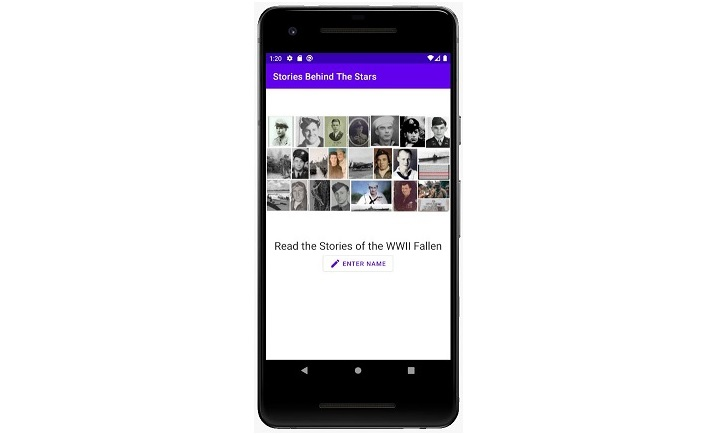

#Updates

UPDATE 3 June 2021: App Streamlined for Accelerated Release Date

So that the app can be released sooner, the image recognition options have been removed from the home screen with plans to revisit these features after the app is released. The current home screen now only has the option to enter a name:


 
Next week we will be starting UX and graphic design for the app. Time to get it polished up!


UPDATE 16 May 2021: Internal Testing Started!

The api connection is fully functioning and internal testing has started. Finalizing the api connection introduced some bugs with searching from a text-to-image. These will be fixed shortly.

# Stories Behind The Stars - Android App
Development for the Android mobile app for the Stories Behind The Stars project, a non-profit initiative that aims to record and share stories for each of the 400,000 American fallen from WWII. This mobile app will allow visitors at graves and memorials to scan the name of a fallen solider and read their story. More info at: https://www.storiesbehindthestars.org/


# How It Works

This app is intended to be streamline and user-friendly. Below are demo screenshots of how the app will work. Color schemes and other graphic design aspects will change, but these show the general workflow.

The home screen gives 3 options: scan a memorial by taking a photo, select a previously saved photo, or enter a name directly. An info icon at the bottom of the screen will offer more details about the project.


Once a story is found, the simple story display appears. The story display will have a profile picture, a background picture, the fallen soldier’s  name, and the story. If either image is not provided, the app will use Fold3's default image. 


In some cases, the app will need to display multiple stories. The user may scan a memorial with multiple names, or a single name may have more than one story associated with it. When this happens, the app will show collapsed versions of the stories in a scrollable view. The user can then select which story they wish to read.


# Image-to-Text

This app uses Tesseract Android Tools, an optical character recognition (OCR) developed by Google, to read text from images. For initial implementation of the Tesseract library, I used the following examples as guides:

- [OCR on Android by David González Verdugo](https://solidgeargroup.com/en/ocr-on-android/)

- [Tess-two Example by ashomokdev](https://github.com/ashomokdev/Tess-two_example)


To use the Tess-Two Tesseract library, the app has the following dependency in its build.gradle:

```
dependencies {
    compile 'com.rmtheis:tess-two:6.0.0'
}
```

A TessOCR class in the api package handles the TessBaseAPI. The TessOCR is based mainly on Verdugo's example. However, when the app ran into an error saying the file path did not exist, I implement the `copyTessDataFiles(String path)` function from ashomokdev's project as a solution and changed the data file path to `DATA_PATH = context.getFilesDir()+"";`.

Tesseract requires you to download `.traineddata` files for any language you wish to read. For this app, the data is stored in a a `/tessdata/` folder in the [project assets](https://advancetechtutorial.blogspot.com/2015/01/assets-folder-in-android-studio.html). You can download language files here: [https://github.com/tesseract-ocr/tessdata](https://github.com/tesseract-ocr/tessdata).

A few other things to note about using Tesseract... First, make sure your app has permission to read and write to external storage. Second, this app uses an AsyncTask to run the image-to-text. Without an AsyncTask, the UI will freeze and possibly even crash your app. Any functions for the image-to-text should be in the same Activity class as the AsyncTask.

