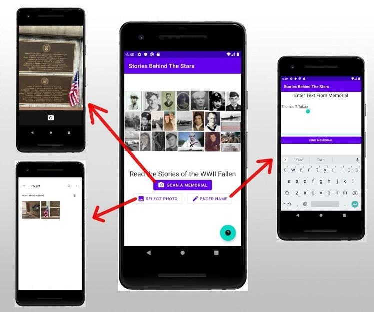

# Stories Behind The Stars - Android App
Development for the Android mobile app for the Stories Behind The Stars project, a non-profit initiative that aims to record and share stories for each of the 400,000 American fallen from WWII. This mobile app will allow visitors at graves and memorials to scan the name of a fallen solider and read their story. More info at: https://www.storiesbehindthestars.org/

# How It Works

This app is intended to be streamline and user-friendly. Below are demo screenshots of how the app will work. Color schemes and other graphic design aspects will change, but these show the general workflow.

The home screen gives 3 options: scan a memorial by taking a photo, select a previously saved photo, or enter a name directly. An info icon at the bottom of the screen will offer more details about the project.

Once a story is found, the simple story display appears. The story display will have a profile picture, a background picture, the fallen soldier’s  name, and the story. If either image is not provided, the app will use Fold3's default image. 

In some cases, the app will need to display multiple stories. The user may scan a memorial with multiple names, or a single name may have more than one story associated with it. When this happens, the app will show collapsed versions of the stories in a scrollable view. The user can then select which story they wish to read.

